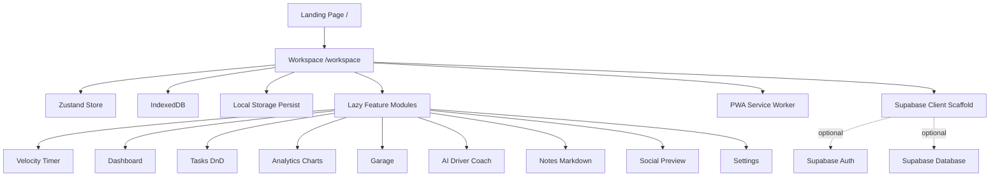

# VelocityOS Architecture Diagram

```mermaid
flowchart TD
    A[Landing Page /] --> B[Workspace /workspace]
    B --> C[Zustand Store]
    B --> D[IndexedDB]
    B --> E[Local Storage Persist]
    B --> F[Lazy Feature Modules]

    F --> F1[Velocity Timer]
    F --> F2[Dashboard]
    F --> F3[Tasks DnD]
    F --> F4[Analytics Charts]
    F --> F5[Garage]
    F --> F6[AI Driver Coach]
    F --> F7[Notes Markdown]
    F --> F8[Social Preview]
    F --> F9[Settings]

    B --> G[PWA Service Worker]
    B --> H[Supabase Client Scaffold]

    H -. optional .-> I[Supabase Auth]
    H -. optional .-> J[Supabase Database]
```
